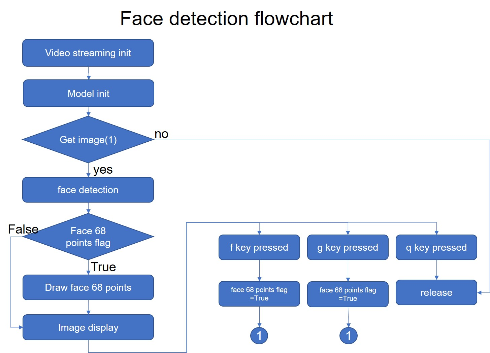

# Dlib_tutorial
●使用Dlib一般版本及USE_CUDA的cnn版本來進行人臉偵測及臉部特徵描點 

●在使用cnn的人臉偵測需要USE_CUDA的dlib版本，要使用cmake建立此版本，詳情請參閱教學  

●流程圖如下

■This is a tutorial of face detection using dlib with normal and USE_CUDA versions. The 68 points of face characteristics are executed too.

■If you want to execute the face detection with USE_CUDA-version dlib, you have to use Cmake to build the packages. The tutorial is here.

■The flowchart is shown below

